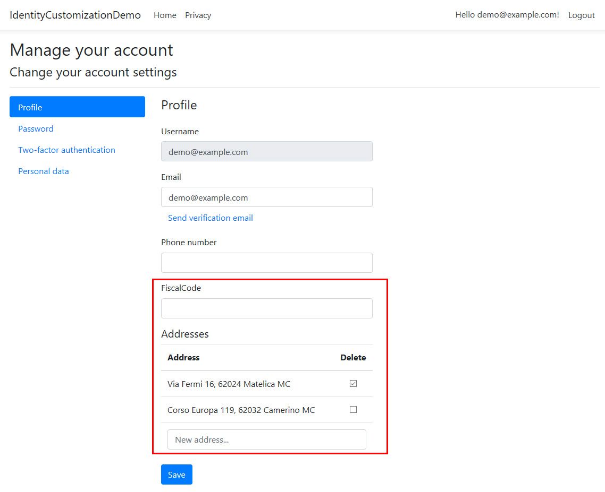

# ASP.NET Core Identity customization demo
This demo project shows how to extend the `IdentityUser` class by adding two custom properties:

 * A scalar property `FiscalCode` of type string;
 * A navigation property `Addresses` to a list of custom entities of type `UserAddress`.

## UI customization
The UI provided by ASP.NET Core Identity has been customized to let the user set values for both these new properties.



## Custom data download
New values have been included in the JSON file the user can download from the "Personal Data" page, as per the GDPR regulation. 
 Here's a sample of the JSON file.
 ```
 {
  "FiscalCode":null,
  "Addresses":[
    {"Address":"Via Fermi 16, 62024 Matelica MC"},
	{"Address":"Corso Europa 118, 62032 Camerino MC"}
  ],
  "Id":"8419af3a-70ed-46bc-b276-762c8771eeb6",
  "UserName":"demo@example.com",
  "Email":"demo@example.com",
  "EmailConfirmed":"False",
  "PhoneNumber":null,
  "PhoneNumberConfirmed":"False",
  "TwoFactorEnabled":"False"
}
 ```